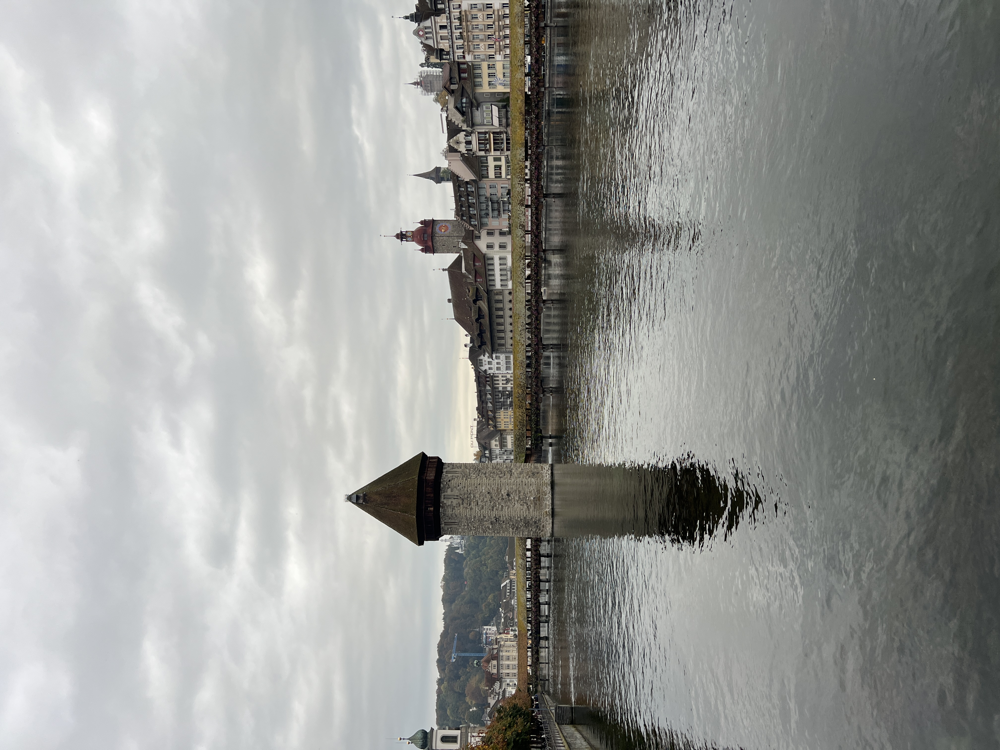
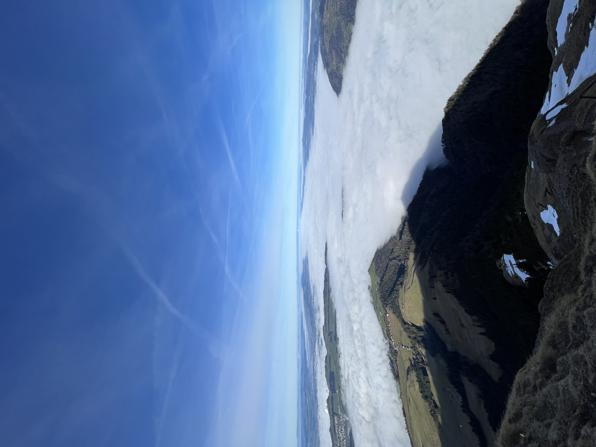
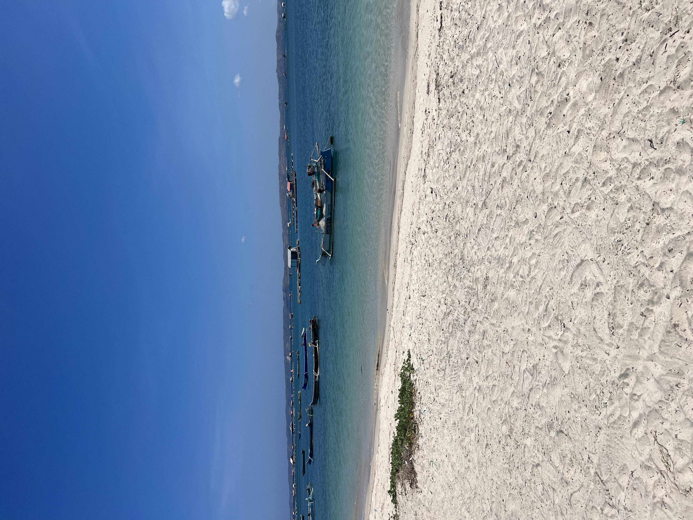

# Presentation SelfClean

I collected 100 images from the HSLU campus in horw and 91 images 
from the Rotkreuz campus. The goal of the selfClean package
([Digital Dermatology - SelfClean Repository](https://github.com/Digital-Dermatology/SelfClean/tree/main))
 will be to detect data quality issues such as near duplicates, outliers and mislabeled iamges.  

## Mislabeled Image
I intentionally moved the image "Horw_2439.JPG," which was taken in Horw, into the folder for Rotkreuz.
The goal of the SelfClean is the identify this image as mislabeled.

  

## Outliers
Outliers are defined as images that are not taken on the campus of HSLU. These are the outliers in the Rotkreuz subfolder: 
- Rotkreuz_2552.JPG
- Rotkreuz_9975.JPG

  
 

The subfolder "Horw" contains the following two outliers: 
- Horw_7789.JPG
- Horw_0517.JPG

  
 

## Near Duplicates 
During the dataset collection, I took multiple images of the same object but different angle. The goal of the SelfClean package is to identify these images. 
These are my expected near duplicates:  
**Expected Near Duplicates 1**
- Horw_2385.JPG
- Horw_2386.JPG

  
   

**Expected Near Duplicates 2**
- Horw_2419.JPG
- Horw_2422.JPG

  
   

**Expected Near Duplicates 3**
- Horw_2424.JPG
- Horw_2425.JPG

  
   

**Expected Near Duplicates 4**
- Rotkreuz_2476.JPG
- Rotkreuz_2477.JPG

  
   

